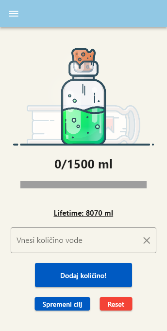
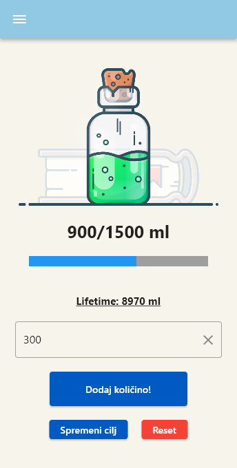
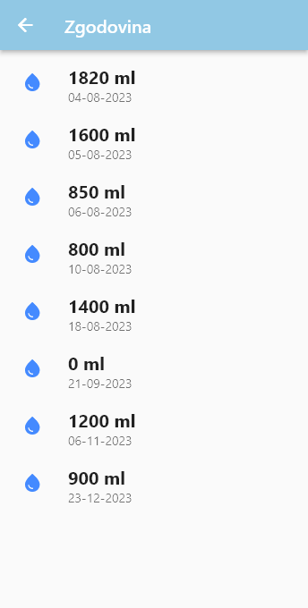

# Water Tracker App - LevelUp

## Description

The Water Tracker App is a Flutter application designed to help users monitor and manage their daily water intake. Stay hydrated and maintain a healthy lifestyle by easily tracking your water consumption with this intuitive and customizable app.

## Screenshots

Adding water intake

History of water intakes

## Features

- **Daily Water Intake Tracking**: Log your water consumption throughout the day.
- **Set Goals**: Set and customize your daily water intake goals.
- **Visualize Your Progress**: View historical data to track your hydration habits.
